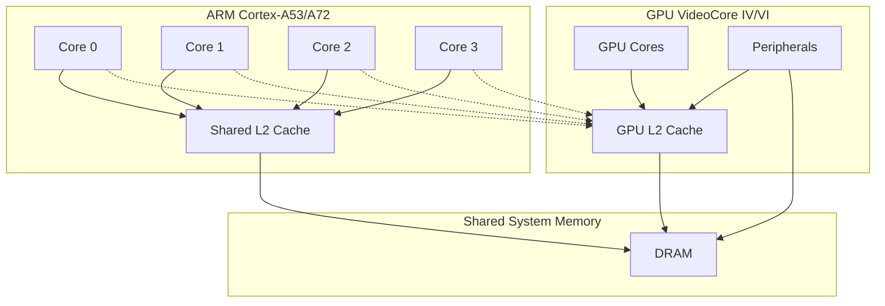

# The Raspberry Pi kernel startup sequence

## Overview

This document traces the complete boot process of a Raspberry Pi, from power-on to kernel execution. Understanding this sequence is crucial for bare-metal programming and system-level development.

**Key takeaways:**
- The GPU, not the ARM CPU, controls the initial boot process
- Multiple files work together: bootloader.bin, config.txt, start*.elf, and kernel*.img
- The ARM cores start in firmware mode (EL3) and are downgraded to hypervisor mode (EL2)
- Only core 0 runs your kernel initially; cores 1-3 wait in a sleep state

**Disclaimers:**
- This relates what happens when the device is turned on with an SD card inserted. Other boot modes (USB, network...) are not directly covered, although much of what is said here still applies.
- This applies to the Pi 3B and 4B, which are the ones it was tested with. Other models, older or newer, might present differences not covered here.

## 1. Before the kernel code starts

When the Raspberry Pi powers up, the GPU's processor boots first and executes code stored in its ROM. This ROM code initializes various peripherals, particularly the SD card reader, then locates and loads the bootloader.bin file from the SD card.

**Note:** On the Pi 4 and above, bootloader.bin is stored in an EEPROM instead of on the SD card. The ROM code must still retain enough functionality to load a recovery program from an SD card to prevent bricking the device if a faulty bootloader is written to the EEPROM.

The bootloader.bin code runs on the GPU's processor. It initializes additional peripherals, loads the config.txt file, and selects and loads the appropriate start*.elf file (along with its corresponding fixup*.dat file), which also executes on the GPU.

The start*.elf file is significantly larger and contains the complete firmware for managing peripherals. This firmware primarily runs on the GPU's processor, and many aspects of the Raspberry Pi's hardware are controlled by communicating with this firmware through a full-duplex mailbox interface.

The start*.elf firmware also loads commandline.txt and the device tree file. While these are intended for the Linux kernel, the device tree remains useful for bare-metal programming as it provides hardware information. Most importantly, it's the only reliable way to determine the actual RAM size, which is particularly crucial on Pi 4 models that come with different memory configurations.

Finally, start*.elf loads the kernel*.img file into memory at address 0x8'0000 (though it's possible to load at a higher addresses via configuration). It also copies a small ARM program called the "armstub" to address 0 and starts all ARM cores executing from that location.

All ARM cores initially run the armstub code, which transitions them from EL3 (firmware level) to EL2 (hypervisor level). Cores 1, 2, and 3 enter a waiting state, while core 0 performs some additional hardware initialization before jumping to 0x8'0000 to start the kernel.

**Resources:**
- Default armstub source: https://github.com/raspberrypi/tools/blob/master/armstubs/armstub8.S
- Custom armstub configuration: https://www.raspberrypi.com/documentation/computers/legacy_config_txt.html#armstub
- Custom kernel load address configuration: https://www.raspberrypi.com/documentation/computers/legacy_config_txt.html#kernel_address
- The firmware mailbox interface: https://github.com/raspberrypi/firmware/wiki/Mailboxes

## 2. The kernel running environment

When the kernel starts executing, it's running in a severely constrained environment that bears little resemblance to what you'd expect from a fully-initialized operating system. While many bare-metal tutorials jump straight into peripheral programming or OS development concepts, understanding and properly configuring this initial environment is crucial for achieving acceptable performance.

The kernel begins execution with L1 caches disabled and all memory mapped as "device" memory, resulting in dramatically reduced performance. To put this in perspective: a simple operation like filling a 1280×720 16-bit image buffer can take several seconds instead of the sub-millisecond performance you'd see with proper cache configuration.

Let's examine the key aspects of this initial environment and understand why proper initialization is essential.

**Resources:**
- The Pi3's ARM Cortex-A53 processor manual: https://developer.arm.com/documentation/ddi0500/latest/
- The Pi4's ARM Cortex-A72 processor manual: https://developer.arm.com/documentation/100095/0003/
- The ARM A-profile Architecture Reference Manual (ARM - heh) (PDF download): https://developer.arm.com/documentation/ddi0487/lb/?lang=en

### 2.1. CPU caches and memory performance

The ARM cores in Raspberry Pi 3 and above feature a two-level cache hierarchy:

**L1 Cache:** Small, per-core caches that provide near-instantaneous memory access for frequently used data and instructions.

**L2 Cache:** A larger, shared cache that reduces the impact of main memory latency across all cores.

At startup, L1 caches are completely disabled, while L2 is enabled but unused because all memory appears as non-cacheable "device" memory. This configuration creates a performance bottleneck so severe it's practically unusable for real applications.

**Performance impact example:** Writing to a 2MB buffer (equivalent to a 1280×720×16-bit display) takes several seconds instead of ~1 millisecond with caches enabled.

Beyond performance, device memory mapping imposes additional restrictions:
- **Strict alignment:** Unaligned memory accesses trigger data aborts
- **No speculation:** CPU cannot prefetch potentially useful data
- **Sequential ordering:** Memory operations must complete in program order
- **No write optimization:** Each write operation blocks until completion
- **Limited instructions:** Multi-register load/store operations may be restricted
- **No atomics:** Atomic operations are unavailable (though the other restrictions make them unnecessary)

The root cause of these limitations is the disabled Memory Management Unit (MMU). Without the MMU, the system cannot distinguish between different memory types, forcing everything into the restrictive "device" category.

**GPU L2 Cache:** An additional L2 cache exists in the system, used by the GPU. In older Raspberry Pi models (Pi 1), this was the only L2 cache available, creating contention between CPU and GPU memory accesses. Starting with the Pi 2B, the CPU complex was upgraded to the Cortex-A53 and gained its own dedicated L2 cache, allowing the GPU to use its L2 cache exclusively and eliminating this performance bottleneck.

According to the Raspberry Pi 4's memory map, this connection between the CPU cores and the GPU L2 may be available at a particular ARM "physical" address, which may allow for more efficient, coherent data communication between the two processors.

**Resources:**
- Armv8-A Memory Model Guide (PDF): https://developer.arm.com/-/media/Arm%20Developer%20Community/PDF/Learn%20the%20Architecture/Armv8-A%20memory%20model%20guide.pdf
- Cortex-A53 memory types: https://developer.arm.com/documentation/ddi0500/j/Level-1-Memory-System/Support-for-v8-memory-types?lang=en
- Cortex-A53 L1 cache: https://developer.arm.com/documentation/ddi0500/j/Level-1-Memory-System/About-the-L1-memory-system?lang=en
- Cortex-A53 L2 cache: https://developer.arm.com/documentation/ddi0500/j/Level-2-Memory-System/About-the-L2-memory-system?lang=en

### 2.2. Memory layout and addressing

Before describing the operation of the MMU, we need to talk about how different types of memory are laid out and made visible to the different parts of the system. Please, note that the memory maps differ in significant ways between the different models of Raspberry Pi.

There are multiple views of memory in the system:
- The GPU is at the forefront of the SoC and it sees everything using "bus addresses".
- Some of the internal peripherals have a limited view of the "bus addresses". For instance, DMA units cannot see all the memory in the higher-end Pi 4.
- The ARM cores have a virtualized "physical" view of the memory map, controlled by the GPU, where some blocks appear at different addresses.
- Once the ARM MMU is enabled, the kernel can choose to map the ARM physical addresses to new locations in the virtual memory map that the ARM code sees.

And the memory map contains different zones, or providers of memory:
- SDRAM is the main memory. 1 GB on the Pi 3B, less in the older models and up to 8 GB on the Pi 4.
- 

**Raspberry Pi 3 bus memory map:**

Raspberry

**Resources:**
- Raspberry Pi 1-3 SoC memory map and peripherals: https://datasheets.raspberrypi.com/bcm2835/bcm2835-peripherals.pdf
- Raspberry Pi 4 SoC memory map and peripherals: https://datasheets.raspberrypi.com/bcm2711/bcm2711-peripherals.pdf

### 2.3. Memory Management Unit (MMU) configuration

### 2.4. Essential peripheral initialization

**Resources:**
- ARM-local peripherals: https://datasheets.raspberrypi.com/bcm2836/bcm2836-peripherals.pdf
- Raspberry Pi 1-3 SoC memory map and peripherals: https://datasheets.raspberrypi.com/bcm2835/bcm2835-peripherals.pdf
- Raspberry Pi 4 SoC memory map and peripherals: https://datasheets.raspberrypi.com/bcm2711/bcm2711-peripherals.pdf
